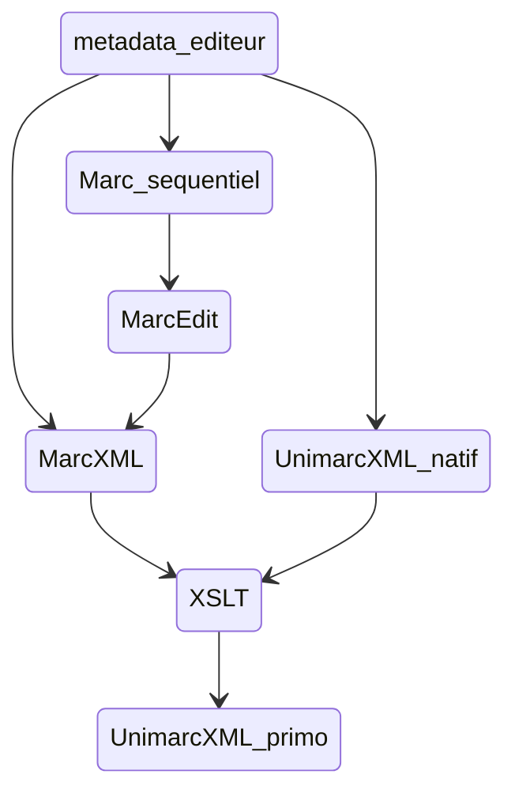

# DataHub_signalement_docelec

Ce répertoire contient les différentes feuilles de style XSLT utilisées pour alimenter l'Opac (Primo) avec des  métadonnées de documentation électroniques, ainsi que les fonctions et méthodes python nécessaires à leur exécution. 

Ces scripts de data preprocessing qui permettent d'automatiser sous forme de de pipe de données les phases manuelles de mise en forme des métadonnées pour Primo peuvent être lancés en CLI (ligne de commande) ou depuis une UI sommaire dans le Jupyter Noptebook execute_workflow.ipynb.

Les diverses sources de données concernées sont :
 - FTF : les métadonnées de revues électroniques (plus qqs bouquets d'ebooks) gérées dans Full Text Finder (Ebsco)
 - Cairn : les métadonnées d'ebooks du bouquet QSJ + les acquiisitions au titre à titre
 - Cyberlibris : les métadonnées d'ebooks du bouquet Cyberlibris
 - Numilog : les acquisitions d'ebooks au titre à titre sur la plateforme Numilog
 - Springer bouquet Math & stats : les métadonnées d'ebooks des bouquets annuels Springer Math & stat (achat LJAD).
 
**Important** : du fait de la diversité des sources de métadonnées (FTF & éditeurs) et de leurs modalités de récupération, les pipes ne gèrent pas leur moissonnage dynamique à la source, les fichiers doivent être préalablement récupérés sur les interfaces dédiées et déposés dans HOME/source_files/
 
Ce sous-ensemble du DataHub SCD peut être actionné depuis si-csd.unice.fr pour une utilisation distante ou être installé en local sur son PC (Windows)

## Installation sur si-scd.unice.fr

L'environnement python ainsi que les scripts sont déjà installés et prêts à l'usage sur le serveur.

cf voir cette page du wiki pour installer Anaconda sur l'OS Centos 7

## Installation locale

### Pré-requis

Python v3

Nécessite l'environnement Anaconda pour ouvrir le notebook (facultatif)

### Installation (Windows)

Télécharger l'archive zippée ou cloner le dépôt depuis Github

Installer le dossier n'importe où sur le PC

Il est en général conseillé de créer un environnement virtuel propre au projet afin d'isoler le binaire et les packages Python spécifiquement utilisés de l'environnement de base et éviter les conflits de version.

Se placer à la racine du dossier et lancer les commandes :

```
virtualenv NOM_DE_VOTRE_ENV # créé un environnement virtuel
cd NOM_DE_VOTRE_ENV/Scripts + activate # active l'environnement virtuel
pip install -r ../../requirements.txt # installe toutes les dépendances
```

### Usage (en local et sur serveur distant si-scd.unice.fr)

#### Dépôt du fichier de métadonnées à moissonner

Déposer le fichier source (issu de FTF ou Cairn ou Cyberlibris...) dans le dossier HOME/source_files/ (libellé du fichier indifférent).
A l'issue de l'excution de chaque pipe, le fichier résultat est automatiquement déposé dans HOME/result_files/

*Sur si-scd.unice.fr les chemins respectifs sont /home/scd/DataHub_signalement_docelec/source_files/ et /home/scd/DataHub_signalement_docelec/result_files/*

#### CLI

Se placer à la racine du dossier de fichier 
*sur si-scd.unice.fr : cd /home/scd/DataHub_signalement_docelec*

Et lancer le script execute_workflow avec les 2 paramètres attendus
* -w:atoz|cairn_qsj|cairn_titre_a_titre|cyberlibris|numilog (au choix)
* -f:<NOM_DU_FICHIER_DE_METADONNEES> 

Exemples

```
python execute_workflow.py -w:ftf -f:ftf_source_records.csv
python execute_workflow.py -w:numilog -f:numilog.xml
```

#### Notebook

En plus de la CLI, les workflows peuvent être lancés depuis un formulaire construit avec des ipwidgets dans le Jupyter Notebook execute_workflow_ui.ipynb, ou encore depuis une mini-UI générée en surcouche du notebook grâce au package Voila.

Pour ouvrir le notebook : passer par le navigateur Anaconda, lancer l'application Jupyter Lab et naviguer dans l'explorateur de fichier pour retrouver l'emplacement du notebokk (une fois ouvert et si besoin, changer le kernel actif en se connectant à son environnement virtuel)

- notebook
- voila

*Sur si-scd.unice.fr l'url du notebook est...*

### Fonctionnement

Les différentes feuilles de style tournent avec le processeur XSLT Saxon installé en dur dans le dossier (HOME/saxon-he-9.4.0.7.jar)

L'appel au processeur Saxon avec les différents paramètres de fichiers en fonction des workfloxs (paths des feuilles de tyle, du fichier source et du fichier résultat) s'effectue dans des scripts serveurs adaptés au système d'exploitation qui héberge le code (celui-ci étant auto-détecté par le script Python) : sur Linux le script shell run_saxon.sh est mobilisé, sous Windows le script batch run_saxon.bat.

L'appel au batch ou au shell est piloté depuis le fichier execute_workflow.py qui centralise l'essentiel des traitements (gestion des paramètres et organisation des phases intermédiaires de pré-traitements, notamment pour la source Full Text Finder), en récupérant les 2 paramètres associés à la commande de lancement (-w et -f).

L'exécution depuis le notebook suis le même enchainement et actionne les mêmes scripts, en apportant "seulement" une couche plus user friendly sous forme de formulaire composé de widgets pour donner une accès en mode "non-expert".


 ## Remarques générales sur le circuit complet de signalement pour les ebooks

 *Les feuilles de style dédiées sont dans le dossier /ebooks du repositery.*

 Le workflow général quelle que soit la source de données consiste à aboutir à un fichier Unimarc xml prêt à être chargé dans Primo



 Pour voir la doc détaillée des workflow source par source : [https://wiki.univ-cotedazur.fr/display/SCDSIGB/Ebooks+dans+Primo](https://wiki.univ-cotedazur.fr/display/SCDSIGB/Ebooks+dans+Primo)


