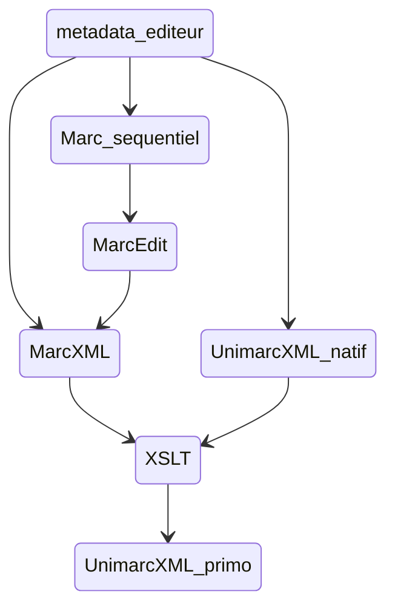

# XSLT_signalement_docelec
 Ce répertoire contient les différentes feuilles de style XSLT utilisées pour alimenter l'Opac (Primo) avec diverses sources de métadonnées de documentation électroniques.

Les sources de données ayant donné lieu au paramétrage de pipes de moissonnage spécifiques et nécessitant un workflow de traitement en amont sont :
 - AtoZ : les métadonnées de revues électroniques (plus qqs bouquets d'ebooks) gérées dans Full Text Finder (Ebsco)
 - Cairn : les métadonnées d'ebooks du bouquet QSJ + les acquiisitions au titre à titre
 - Cyberlibris : les métadonnées d'ebooks du bouquet Cyberlibris
 - Numilog : les acquisitions d'ebooks au titre à titre sur la plateforme Numilog
 - Springer bouquet Math & stats : les métadonnées d'ebooks des bouquets annuels Springer Math & stat (achat LJAD).

 ## Remarques générales sur le circuit complet de signalement pour les ebooks

 *Les feuilles de style dédiées sont dans le dossier /ebooks du repositery.*

 Le workflow général quelle que soit la source de données consiste à aboutir à un fichier Unimarc xml prêt à être chargé dans Primo

 Les différentes feuilles de style peuvent être lancées soit dans un processeur XSLT en standalone (par exemple Kernow), ou dans un éditeur XML intégrant un processeur (par ex Oxygen), ou encore être ajoutées dans le code d'uen instance locale du logiciel MarcEdit (option privilégiée afin de centraliser le maximum d'opérations dans un même outil).

 Pour voir la doc détaillée des workflow source par source : [https://wiki.univ-cotedazur.fr/display/SCDSIGB/Ebooks+dans+Primo](https://wiki.univ-cotedazur.fr/display/SCDSIGB/Ebooks+dans+Primo)

## Remarques générales sur le circuit complet de signalement pour les revues en ligne (source FTF)

*Les feuilles de style dédiées sont dans le dossier /atoz du repositery.*

## Remarques générales sur la config de MarcEdit

* Doc sur MarcEdit + installation : [https://marcedit.reeset.net/downloads](https://marcedit.reeset.net/downloads)
* Doc MarcEdit sur l'ajout simple d'une XSLT [https://marcedit.reeset.net/software/xslt/load.txt](https://marcedit.reeset.net/software/xslt/load.txt)

### Ajouter les feuilles XSLT du repo dans son install MarcEdit locale 

1. Copier/coller les 2 dossiers /ebooks et /atoz dans $MARCEDIT_HOME/xslt

2. Si la feuille de style utilise des fonctions spécifiques à la v2 XSLT, choisir le processeur Saxon lors de l'ajout dans le panneau d'édition de la config de MarcEdit (le processeur par défaut MSXML est compatible uniquement v1).
**Le processeur à privilégier est mentionné en commentaire au début de chaque fichier xsl**

3. Créer les nouvelles tâches dans .... et leur associer la feuille de style qui correspond