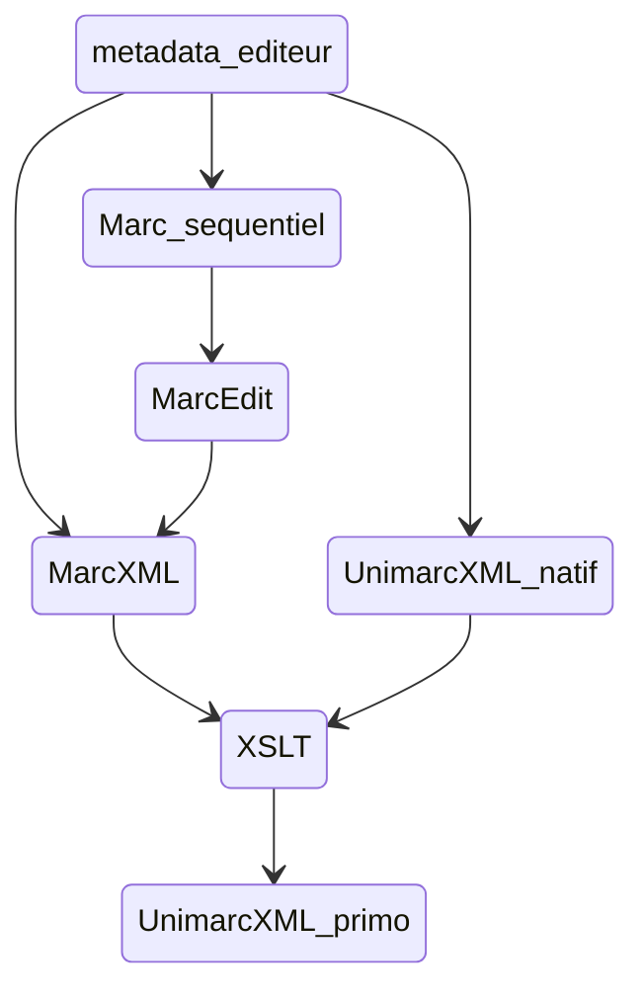

# XSLT_signalement_docelec
 Ce répertoire contient les différentes feuilles de style XSLT utilisées pour alimenter l'Opac (Primo) avec diverses sources de métadonnées de documentation électroniques.

Les sources de données ayant donné lieu au paramétrage de pipes de moissonnage spécifiques et nécessitant un workflow de traitement en amont sont :
 - AtoZ : les métadonnées de revues électroniques (plus qqs bouquets d'ebooks) gérées dans Full Text Finder (Ebsco)
 - Cairn : les métadonnées d'ebooks du bouquet QSJ + les acquiisitions au titre à titre
 - Cyberlibris : les métadonnées d'ebooks du bouquet Cyberlibris
 - Numilog : les acquisitions d'ebooks au titre à titre sur la plateforme Numilog
 - Springer bouquet Math & stats : les métadonnées d'ebooks des bouquets annuels Springer Math & stat (achat LJAD).

 ## Utilisation du dépôt

### Installation

Télécharger l'archive zippée ou cloner le dépôt depuis Github
Installer le dossier n'importe où sur le PC

### Paramétrage

Plusieurs variables et paramètres sont à personnaliser avant l'utilisation
* dans HOME/xsltroot.xsl : mettre en valeur de la variable $root le path absolu du répertoire courant.
* dans les macros du fichier Excel HOME/atoz/files/atoz_preprocessing.xslx : personnaliser les variables sourceTxtFolderPath et xmlOutputFolderPath avec ce même chemin.

### Usage

Les différentes feuilles de style peuvent être lancées soit dans un processeur XSLT en standalone (par exemple Kernow), ou dans un éditeur XML intégrant un processeur (par ex Oxygen), ou encore être ajoutées dans le code d'uen instance locale du logiciel MarcEdit (option privilégiée afin de centraliser le maximum d'opérations dans un même outil).

### Usage dans MarcEdit

#### Remarques générales sur la config de MarcEdit

* Doc sur MarcEdit + installation : [https://marcedit.reeset.net/downloads](https://marcedit.reeset.net/downloads)
* Doc MarcEdit sur l'ajout simple d'une XSLT [https://marcedit.reeset.net/software/xslt/load.txt](https://marcedit.reeset.net/software/xslt/load.txt)
* Localiser l'emplacement des fichiers de son instance MarcEdit déjà installée : lancer le logiciel -> cliquer sur l'écrou en bas à droite de la fenêtre -> cliquer sur Locations dans le bandeau gauche
* Ajouter une feuille de style directement dans son instance MarcEdit : déposer le fichier .xsl dans $MARCEDIT_HOME/xslt

#### Paramétrage des tâches

1. Créer les nouvelles tâches dans .... et leur associer la feuille de style qui correspond

2. En général les feuilles de style proposées utilisent des fonctions spécifiques à la v2 XSLT, il est donc préférable de choisir systématiquement le processeur Saxon lors de l'ajout dans le panneau d'édition de la config de MarcEdit (le processeur par défaut MSXML est compatible uniquement v1).

 ## Remarques générales sur le circuit complet de signalement pour les ebooks

 *Les feuilles de style dédiées sont dans le dossier /ebooks du repositery.*

 Le workflow général quelle que soit la source de données consiste à aboutir à un fichier Unimarc xml prêt à être chargé dans Primo



 Pour voir la doc détaillée des workflow source par source : [https://wiki.univ-cotedazur.fr/display/SCDSIGB/Ebooks+dans+Primo](https://wiki.univ-cotedazur.fr/display/SCDSIGB/Ebooks+dans+Primo)


## Remarques générales sur le circuit complet de signalement pour les revues en ligne (source FTF)

*Les feuilles de style dédiées sont dans le dossier /atoz du repositery.*

1. Downloader les métadonnées depuis l'admin de FTF en renseignant le formulaire d'export ainsi
2. Déposer le fichier atoz_export.txt dans HOME/atoz/temp_processing_files
3. Ouvrir HOME/atoz/temp_processing_files/atoz_preprocessing.xslx
    - Onglet développeur -> Macros : faire tourner les 3 macros de step1 à step3
    - ou si l'export mappé en xml ne fonctionne pas, faire le mapping manuellement à partir du mappage XMl déjà présent dans Source + exporter
4. nommer l'export xml atoz_preprocessing.xml et le déposer dans HOME/atoz/temp_processing_files
5. Avec le jar saxon9he (se placer dans Kernow/lib) lancer en ligne de commande 
```
java -jar "C:\Program Files\Kernow 1.8.0.1\lib\saxon9he.jar" -s:C:\Users\BUNICE\Documents\GitHub\XSLT_signalement_docelec\atoz\temp_processing_files\atoz_export.xml -xsl:C:\Users\BUNICE\Documents\GitHub\XSLT_signalement_docelec\atoz\xslt\atoztemp4primo.xsl -o:C:\Users\BUNICE\Documents\GitHub\XSLT_signalement_docelec\atoz\result_files\atoz.xml
```